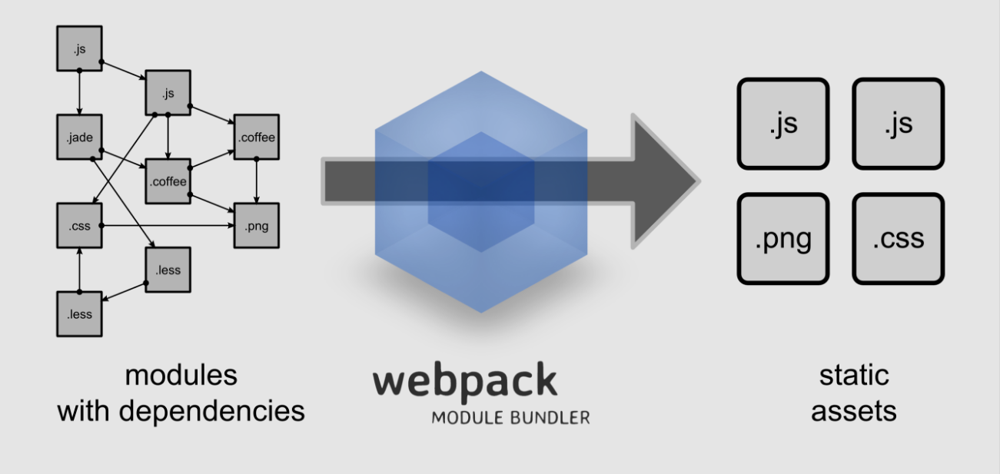

# Webpack
### 웹팩이란?
> **모듈을 번들링하는 도구**, 의존성을 지닌 모듈을 추적하여 정적인 asset을 생성함  
유사한 모듈 번들러로 Browserify가 있음

### 웹팩의 강점
* .js파일 뿐만아니라 .css, .png 등 다양한 파일 형식의 번들링을 제공함  

* 다른 모듈 번들러, 개선이 필요한 영역을 감시함

### 웹팩의 목적
* 의존성 트리를 몇 개의 덩어리로 분할함
* 최초 파일 로드 시간을 단축함
* 모든 정적인 asset들은 모듈이 될 수 있어야함
* 써드파티 라이브러리와 모듈들을 통합함
* 모듈 번들러의 거의 모든 부분들을 커스터마이징 할 수 있어야함
* 대규모 프로젝트에 적합함

### 웹팩의 설치
```bash
# 터미널 창에서
(sudo) npm install -g webpack
```

### config.js파일 활용하기
> webpack.config.js는 **웹팩의 수많은 옵션들을 파일화**하여 남겨둔 것, 웹팩 번들링에 있어서 필수 요소라 할 수 있음

1. webpack.config.js 생성하기
```bash
# 터미널 창에서
touch webpack.config.js
```
2. entry와 output 지정해주기  
```javascript
  // webpack.config.js 파일 내부에
  module.exports = {
    entry: './filename.js',
    output: {
      filename: './bundle.js'
    }
  }
```
  * 이후에 `filename.js`가 위치한 폴더에서 `webpack`을 입력해주면 **`webpack.config.js`의 설정대로 output 파일이 생성되는 것을 확인할 수 있음**

아래 항목부터는 선택 옵션임.

#### watch 모드 활성화
> 웹팩이 프로젝트를 감시하는 상태로 유지하며, 의존성을 지닌 모듈의 내용이 변화할 때마다 실시간으로 번들링하는 기능

```javascript
  // webpack.config.js 파일 내부에
  module.exports = {
    // ...
    watch: true
  }
```
또는
```bash
# 터미널 창에서
webpack -w
또는 webpack --watch
```

#### [매우중요] loader 활용
> 기본적으로 웹팩은 .js만을 인식할 수 있음**(로더 없이 .css, .png 등 인식 불가)**, 로더를 통해 수많은 형식의 파일을 번들링할 수 있음

1. 로더를 활용하려면...
  * `package.json`이 필요
  ```bash
  # package.json이 없는 경우, 프로젝트 최상단 폴더에서, nodejs가 설치되어있어야함
  npm init
  ```
2. 필요한 로더 설치
  * 사용자의 필요에따라 다양한 로더를 선택하여 설치가능
  ```bash
  # package.json이 위치한 폴더에서
  npm install --save-dev `필요한로더이름`
  ```
  * 이후에 `package.json`의 devDependencies 항목에 해당 로더가 추가된 것을 확인할 수 있음
3. 자주쓰는 로더
  * 자바스크립트 es2015 => es5 변환
  ```bash
  npm install --save-dev babel-loader babel-core babel-preset-es2015
  ```
  * css 로더
  ```bash
  npm install --save-dev css-loader style-loader
  ```
    * css-loader는 .css파일을 import할 수 있게 만들어줌, style-loader는 import한 .css를 실제로 사용 가능하게 만들어줌
    * 해당 .css를 사용하는 .js에 import 구문을 추가해주어야함
    ```javascript
    // filename.js
    import './cssfile.css';
    ```
4. 설치한 로더 config.js에 추가해주기
```javascript
// webpack.config.js 파일 내부에
  module.exports = {
    // ...
    module: {
      loaders: [
        // babel 로더 사용
        {
          // 모든 .js를 대상으로함
          test: /\.js$/,
          // node_modules 폴더의 내용은 제외함
          exclude: /node_modules/,
          // babel 로더를 사용
          loader: 'babel',
          // 부가기능 서술, es2015 설정을 적용
          query: {
            presets: ['es2015']
          }
        },
        {
          test: /\.css$/,
          exclude: /node_modules/,
          loader: 'style!css'
        }
      ]
    }
  }
```

### Development Server 활용하기
> 개발 환경을 위한 임시 서버를 손쉽게 셋팅할 수 있음

```bash
npm install -g webpack-dev-server
```
* 이후에 `webpack-dev-server` 명령어를 통해 서버 구동 가능

### 웹팩 production용으로 번들링하기
> minification: 주석이나 변수명을 간소화하여 파일의 용량을 줄이는 작업

```bash
# 터미널에서
webpack -p
또는 webpack --optimize-minimize
```

# 참고자료
* [Scotch.io - Getting Started with Webpack](https://scotch.io/tutorials/getting-started-with-webpack-module-bundling-magic)
