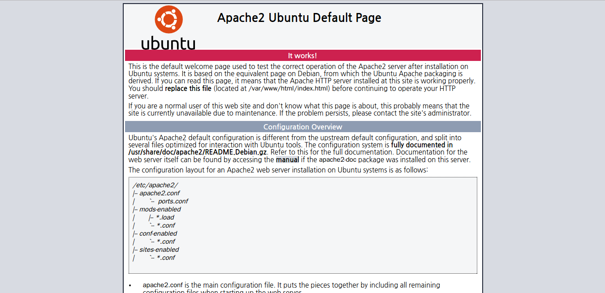

# LEMP(LAMP)
### LEMP(LAMP)란?
> Linux, Nginx(Apache), MySQL, PHP로 구성된 서버를 지칭하는 용어, 주로 동적 웹 페이지/웹 어플리케이션 구축에 사용됨  
Linux: 기반이 되는 OS  
Nginx/Apache: 웹서버로 사용  
MySQL: 백엔드 데이터 저장을 위한 DB  
PHP: 동적인 프로세스를 제어하는 데에 이용

## 구축 순서
> 리눅스 운영체제가 설치되어있어야함, 이 문서에서는 **우분투 16.04**를 기준으로 서술

1. 엔진엑스(아파치) 설치
  ```bash
  # 엔진엑스
  sudo apt-get update
  sudo apt-get install nginx

  # 아파치
  sudo apt-get update
  sudo apt-get install apache2
  ```
  1. 아파치 설치되었는지 확인
    * 브라우저에서 본인의 ip로 접속(개인 pc에서 확인하려면 `localhost`로 접속)
    * 아래와 같은 화면이 나오면 성공
    
    * 기본적으로 아파치의 루트 폴더는 `/var/www/html`로 설정됨
  2. 아파치 설정 변경
    ```bash
    sudo vim /etc/apache2/sites-available/000-default.conf

    # 아파치에서 php를 우선적으로 실행하도록 설정
    sudo vim /etc/apache2/mods-enabled/dir.conf
    => `index.php가 DirectoryIndex 바로 뒤에 오도록 변경`
    <IfModule mod_dir.c>
        DirectoryIndex index.php index.html index.cgi index.pl index.xhtml index.htm
    </IfModule>

    # 아파치 루트폴더 변경
    sudo vim /etc/apache2/sites-available/000-default.conf
    => `DocumentRoot부분을 수정`
    DocumentRoot `원하는 경로로 설정`
    =>`변경된 루트폴더를 아파치에서 인식하도록 반영`
    sudo vim /etc/apache2/apache2.conf
    => `파일 중반부에 <Directory ...></Directory> 추가`
    <Directory `변경된 루트폴더`>
        Options Indexes FollowSymLinks
        AllowOverride None
        Require all granted
    </Directory>
    => `아파치 재실행`
    sudo service apache2 restart
    ```
  3. 아파치 구동하기
  ```bash
  sudo service apache2 `start|stop|graceful-stop|restart|reload|force-reload`
  ```  
2. mysql 설치하기
```bash
sudo apt-get install mysql-server mysql-client
```
  1. mysql 구동하기
  ```bash
  sudo service mysql `start|stop|restart|reload|force-reload|status`
  ```
3. php 설치하기
```bash
# 우분투 16.04 기준 php7이 기본 제공 버전임
# libapache2-mod-php7: 아파치와 php 연동
# php7-mysql: php와 mysql 연동
sudo apt-get install php libapache2-mod-php7 php7-mysql
```
  1. php 설정 변경하기
  ```bash
  # 아파치와 관련된 설정을 변경해 줄 수 있음
  vim /etc/php/7.0/apache2/php.ini
  ```

# 참고자료
* [How To Install Linux, Nginx, MySQL, PHP (LEMP stack) in Ubuntu 16.04](https://www.digitalocean.com/community/tutorials/how-to-install-linux-nginx-mysql-php-lemp-stack-in-ubuntu-16-04)
* [How To Install Linux, Apache, MySQL, PHP (LAMP) stack on Ubuntu 14.04](https://www.digitalocean.com/community/tutorials/how-to-install-linux-apache-mysql-php-lamp-stack-on-ubuntu-14-04)
* [신규 OS 우분투 16.04 LTS apt-get으로 APM 설치하기](http://idchowto.com/?p=26726)
